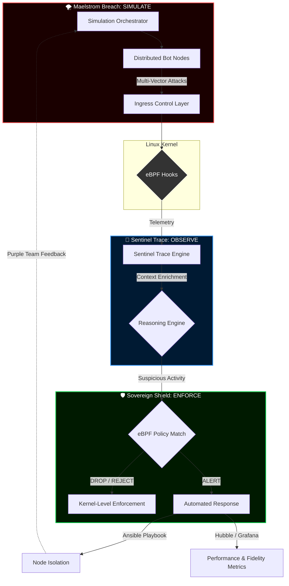

# 👁️ eyeC(ybersecurity) ~ (... I see!) — Beyond Defense, Absolute Visibility

> *"Turning the invisible into actionable defense. A Closed-Loop Security Trilogy."*

L'écosystème eyeC est une suite de projets intégrés conçue pour démontrer la maîtrise du cycle de vie d'un incident de cybersécurité, de l'émulation de l'adversaire à la réponse automatisée au niveau du noyau (Kernel).

---

## 🏗️ L'Architecture de la Trilogie

Mon approche repose sur l'interconnexion de trois piliers fondamentaux :

### 1. 🛡️ Sovereign-Shield (The Enforcement Plane)

* **Rôle :** IPS (Intrusion Prevention System) & Orchestrateur de Quarantaine.
* **Technologies :** C++, Kubernetes (K3s), eBPF (Cilium), Ansible.
* **Innovation :** Capacité d'isoler des nœuds compromis en temps réel via des politiques réseau "Hardened" sans interruption de service.

### 2. 🛰️ Sentinel-Trace (The Intelligence Brain)

* **Rôle :** IDS (Intrusion Detection System) & Moteur de Corrélation.
* **Technologies :** C++, eBPF (Tetragon), MITRE ATT&CK Mapping.
* **Innovation :** Analyse comportementale au niveau du noyau Linux pour détecter des chaînes d'attaques complexes (ex: Reverse Shells) là où les outils traditionnels échouent.

### 3. 🌪️ Maelstrom-Breach (The Adversary Engine)

* **Rôle :** BAS (Breach & Attack Simulation) & Red Teaming.
* **Technologies :** C++, Python, Bash.
* **Innovation :** Automatisation de campagnes d'attaques multi-étapes (DDoS, SQLi, Ransomware) pour valider l'efficacité des boucliers défensifs.

---

## 🔄 Le Cycle de Validation "eyeC"

Voici comment les trois projets collaborent lors d'une simulation :

1. **ATTACK :** `Maelstrom-Breach` lance une campagne de Ransomware (`ransom_sim.cpp`).
2. **DETECTION :** `Sentinel-Trace` identifie un pic d'appels système suspects via ses hooks eBPF et corrèle l'activité.
3. **RESPONSE :** `Sentinel-Trace` envoie un signal critique à `Sovereign-Shield`.
4. **PROTECTION :** `Sovereign-Shield` exécute instantanément une isolation réseau du nœud cible.

---

## 🛠️ Stack Technique Globale

* **Languages :** C++17 (Performance), Python (Payloads), Bash (Automation).
* **Infra :** Kubernetes, Docker, Multi-OS (Debian, AlmaLinux, Windows).
* **Security :** eBPF/Tetragon, Cilium, MITRE ATT&CK, NIST Framework.
* **Ops :** Ansible (IaC), CMake, CI/CD.

---

## 🧱 Architecture: Global View

---

## ⚠️ Continuous Evolution Notice

The **eyeC** triplet—Sovereign-Shield, Sentinel-Trace, and Maelstrom-Breach—is currently under active and continuous development.

**Note:** This project is a living research framework. It is recommended to check the latest commits in each repository for the most up-to-date implementation details.

## 👤 Author

**O'djuma Badolo**  
Web Developer | Cybersecurity graduate | DevSecOps Enthusiast  
> *"Building secure systems by thinking like the storm."*
