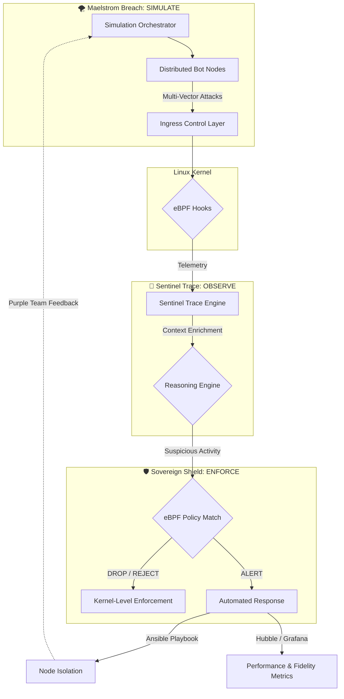

# 👁️ eyeC(ybersecurity) — Beyond Defense, Absolute Visibility — [... I see!]

High-fidelity security engineering focused on kernel-space enforcement and adversarial resilience.

The eyeC ecosystem is built upon a specialized triplet of projects designed to achieve absolute visibility and automated enforcement within Linux environments. This architecture integrates offensive simulation, real-time kernel tracing, and zero-trust orchestration.

---

## 🏗️ The Core Triplet

The framework operates as a closed-loop system where each component validates or empowers the others.

### 🌪️ MAELSTROM-BREACH
**The Offensive Catalyst**

- **Role:** Orchestrates distributed adversary simulations to stress-test defensive boundaries.
- **Capabilities:** L3/L4 SYN flooding, L7 method abuse, and DNS-based data exfiltration.
- **Validation:** Measures the breaking point of security hooks and the fidelity of detection signals under noise.

### 📡 SENTINEL-TRACE
**The Observability Engine**

- **Role:** Provides deep kernel-level telemetry using eBPF probes.
- **Capabilities:** Real-time syscall monitoring (sys_connect, sys_write), network flow analysis, and process lineage tracking.
- **Visibility:** Transforms raw kernel events into actionable security intelligence.

### 🛡️ SOVEREIGN-SHIELD
**The Enforcement Pillar**

- **Role:** Implements zero-trust policies and automated incident response.
- **Capabilities:** Kernel-level traffic dropping via Cilium, micro-segmentation, and sub-3s pod isolation via Ansible.
- **Goal:** Maintains system integrity and ensures policy compliance during active exploitation attempts.
- 
---

## 🔁 The Purple Team Workflow

The integration of the triplet follows a rigorous validation cycle:

1. **Generation:** Maelstrom-Breach injects multi-vector attack traffic into the environment.
2. **Detection:** Sentinel-Trace captures the resulting syscalls and anomalous network patterns.
3. **Enforcement:** Sovereign-Shield applies eBPF-based filters to drop malicious packets at the kernel level.
4. **Response:** The automated pipeline triggers quarantine protocols to isolate compromised assets.

---

## 🛠️ Technical Specifications

| Domain | Technology Stack |
|--------|-----------------|
| Kernel Hooking | eBPF (XDP, TC), Cilium |
| Monitoring | Hubble, Prometheus, Grafana |
| Infrastructure | K3s (Kubernetes), Ubuntu Server, Debian |
| Automation | Ansible, Python, Bash |

---

## 📬 Deployment Status

- **Environment:** Isolated Laboratory Simulation
- **Target Architecture:** Linux Kernel 5.15+ (LTS)
- **Objective:** Achieving a good detection rate for threats

  ---

## Architecture: Global View

