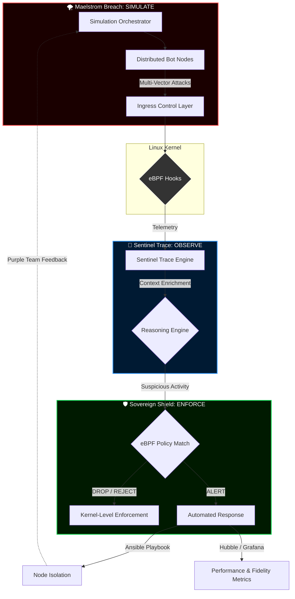

### 🛠️ Engineering Stack
   

### 🛡️ Cyber & Intelligence
   

### ☁️ Infrastructure & Operating Systems
       

# 👁️ eyeC(ybersecurity) ~ (... I see!) — Beyond Defense, Absolute Visibility

> *"Turning the invisible into actionable defense. A Closed-Loop Security Trilogy."*

# 🛰️ The eyeC Project: A Closed-Loop Security Trilogy
> **"Turning the kernel-level invisible into actionable defense."**

The **eyeC Project** is an integrated cybersecurity ecosystem designed to demonstrate mastery over the full incident lifecycle: from **Adversary Emulation** to **Automated Kernel-Level Response**.

---

## 🏗️ The Trilogy Architecture

This ecosystem is built upon three fundamental pillars, interconnected to form a "Self-Healing" infrastructure.

### 1. 🛡️ [Sovereign-Shield](./Sovereign-Shield) (The Enforcement Plane)
* **Role:** IPS (Intrusion Prevention System) & Quarantine Orchestrator.
* **Stack:** C++, Kubernetes (K3s), eBPF (Cilium), Ansible.
* **Core Innovation:** Implements "Zero-Trust" micro-segmentation and real-time node isolation using eBPF-powered network policies without service downtime.

### 2. 🛰️ [Sentinel-Trace](./Sentinel-Trace) (The Intelligence Brain)
* **Role:** IDS (Intrusion Detection System) & Correlation Engine.
* **Stack:** C++, eBPF (Tetragon), MITRE ATT&CK Mapping.
* **Core Innovation:** A behavioral reasoning engine that ingests raw eBPF telemetry to detect complex attack chains (e.g., Reverse Shells or Ransomware patterns) directly within the Linux Kernel.

### 3. 🌪️ [Maelstrom-Breach](./Maelstrom-Breach) (The Adversary Engine)
* **Role:** BAS (Breach & Attack Simulation) & Red Teaming.
* **Stack:** C++, Python, Bash.
* **Core Innovation:** An automated campaign orchestrator that simulates multi-stage APT tactics (DDoS, SQLi, Data Exfiltration) to rigorously validate the defense trilogy's effectiveness.

---

## 🔄 The "eyeC" Validation Loop

The power of this trilogy lies in its synergy. Every defensive update is validated by an offensive simulation:

1.  **ATTACK:** `Maelstrom-Breach` executes a "Storm-Front" campaign, initiating a ransomware simulation (`ransom_sim.cpp`).
2.  **DETECTION:** `Sentinel-Trace` captures the spike in unauthorized system calls via eBPF and correlates the file-system activity.
3.  **REASONING:** The engine identifies a **MITRE T1486** technique and dispatches a critical signal to the enforcement plane.
4.  **RESPONSE:** `Sovereign-Shield` triggers an immediate network quarantine and kills the malicious process tree.

---

## 🛠️ Global Technical Stack

* **Languages:** C++17 (Performance Core), Python (Payloads), Bash (Automation).
* **Infrastructure:** Kubernetes, Docker, Multi-OS Lab (Debian, AlmaLinux, Windows).
* **Security Frameworks:** eBPF/Tetragon, Cilium, MITRE ATT&CK, NIST Cybersecurity Framework (Recover/Protect/Detect).
* **DevOps/IaC:** Ansible, CMake, CI/CD Pipelines.

---

## 🧭 Project Philosophy
Most security tools operate in silos. The **eyeC Project** breaks these silos by creating a **Feedback Loop** where offensive intelligence directly informs defensive posture. 

> *"To build a shield, you must first understand the storm."*

---

## 🧱 Architecture: Global View

---

## ⚠️ Continuous Evolution Notice

The **eyeC** triplet—Sovereign-Shield, Sentinel-Trace, and Maelstrom-Breach—is currently under active and continuous development.

**Note:** This project is a living research framework. It is recommended to check the latest commits in each repository for the most up-to-date implementation details.

## 👤 Author

**O'djuma Badolo**  
Web Developer | Cybersecurity graduate | DevSecOps Enthusiast  
> *"Building secure systems by thinking like the storm."*
